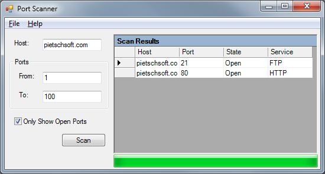

# VB.NET Port Scanner

I was looking over some of the old prototypes I've written in the past, and I can across a Simple Port Scanner that I originally wrote in VB.NET 2003. I originally wrote this back in 2004 (I think), and even posted a compiled version on my website that I have since removed/deleted. So, since it's just sitting on my hard drive collecting virtual dust, I thought I'd post it here in case anyone else can find it useful.

This Port Scanner implements Multi-Threading via the ThreadPool class in the .NET Framework, so at the very least it can be used as an example of how to use the ThreadPool class to queue up "work units" to be executed asynchronously.

Also, as you see in the screenshot below, there is a "Service" column shown in the Grid. This column tells you what Protocol/Service is normally run on that specific port. It doesn't check for that Protocol/Service on that port, but it helps as a quick reference as to what Protocol/Service may be running there. It's nice sometimes to not be required to memorize all the possible Protocols/Services that run on some of the most common ports used. This list of Port Numbers and Services is stored in the `App.Config` file.
